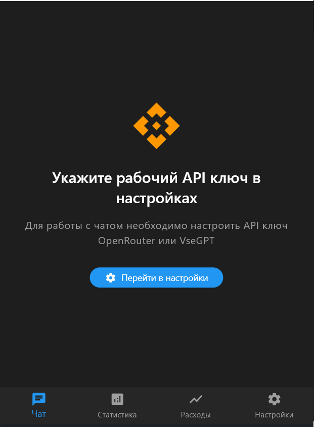
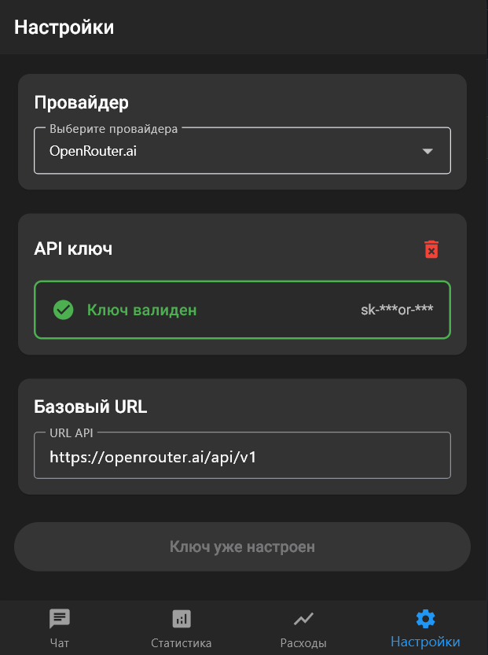

# AIChatFlutter - Чат-приложение с ИИ

**Оригинальный репозиторий:** [https://github.com/neuro-fill/AIChatFlutter](https://github.com/neuro-fill/AIChatFlutter)

AIChatFlutter - это мультиплатформенное приложение для общения с искусственным интеллектом, разработанное с использованием Flutter. Приложение поддерживает работу как с OpenRouter.ai, так и с VseGPT.ru, предоставляя гибкие возможности для взаимодействия с различными языковыми моделями.

## 🚀 Что было реализовано в отличие от оригинала

### ✨ Новый многостраничный интерфейс
- **Главная страница** с навигацией между экранами
- **Экран настроек** для конфигурации API провайдера и ключей
- **Экран статистики** с детальной информацией об использовании токенов
- **Экран графика расходов** с визуализацией ежедневных затрат

  

### 🔐 Улучшенная система безопасности API ключей
- **Шифрованное хранение** API ключей в локальном хранилище
- **Автоматическая валидация** ключей при вводе
- **Блокировка чата** до ввода валидного API ключа
- **Безопасные логи** без вывода частей API ключей в консоль

  

### 🎯 Улучшенное управление состоянием
- **Provider архитектура** для централизованного управления состоянием
- **ApiKeyProvider** для управления API ключами и их валидацией
- **Автоматическое обновление UI** при изменении состояния API ключа

### 🛡️ Надежная обработка ошибок
- **Graceful fallback** при сбоях API
- **Timeout обработка** для сетевых запросов
- **Детальное логирование** для диагностики проблем
- **Пользовательские уведомления** об ошибках

## Поддержка API

### OpenRouter.ai
- Баланс отображается в долларах ($)
- Стоимость сообщений рассчитывается в долларах за миллион токенов
- Широкий выбор языковых моделей от разных провайдеров
- Единый API для доступа к различным моделям

### VseGPT.ru
- Баланс отображается в рублях (₽)
- Стоимость сообщений рассчитывается в рублях за тысячу токенов
- Доступ к популярным моделям с оплатой в рублях
- Оптимизировано для пользователей из России

## Структура проекта

Основные директории и файлы:

- `lib/` - Основной код приложения
  - `main.dart` - Точка входа в приложение
  - `api/` - Модули для работы с API
    - `openrouter_client.dart` - Универсальный клиент для работы с OpenRouter и VseGPT
  - `models/` - Модели данных
    - `message.dart` - Модель сообщения с поддержкой токенов и стоимости
  - `providers/` - State management
    - `chat_provider.dart` - Провайдер для управления состоянием чата
    - `api_key_provider.dart` - Провайдер для управления API ключами
  - `services/` - Сервисы
    - `database_service.dart` - Сервис для работы с локальной базой данных
    - `analytics_service.dart` - Сервис для сбора и анализа статистики
    - `api_key_service.dart` - Сервис для валидации и шифрования API ключей
  - `screens/` - Экраны приложения
    - `home_screen.dart` - Главная страница с навигацией
    - `chat_screen.dart` - Основной экран чата
    - `settings_screen.dart` - Экран настроек
    - `statistics_screen.dart` - Экран статистики
    - `expenses_chart_screen.dart` - Экран графика расходов
- `android/`, `ios/`, `windows/`, `linux/` - Платформо-зависимые конфигурации
- `assets/` - Ресурсы приложения
- `pubspec.yaml` - Зависимости проекта

## Основные модули

### ChatProvider
- Управление состоянием чата и историей сообщений
- Взаимодействие с API (OpenRouter/VseGPT)
- Отслеживание баланса и расходов
- Управление моделями и их настройками

### ApiKeyProvider
- Управление состоянием API ключей
- Валидация и шифрование ключей
- Автоматическое обновление UI при изменении состояния
- Блокировка/разблокировка чата в зависимости от валидности ключа

### Message
- Хранение текста сообщений
- Учет использованных токенов
- Расчет стоимости сообщений
- Метаданные (временные метки, модель)

### OpenRouterClient
- Унифицированный интерфейс для работы с API
- Автоматическое определение провайдера (OpenRouter/VseGPT)
- Форматирование цен в соответствии с провайдером
- Обработка ошибок и повторные попытки

### DatabaseService
- Локальное хранение истории сообщений
- Кэширование данных
- Экспорт истории
- Статистика использования

### AnalyticsService
- Сбор статистики использования
- Анализ эффективности моделей
- Отслеживание времени ответа
- Анализ использования токенов

## Функциональность приложения

### Основные возможности
- Обмен сообщениями с различными языковыми моделями
- Выбор модели из доступного списка
- Отображение баланса в соответствующей валюте ($/₽)
- Подсчет стоимости каждого сообщения
- Отслеживание использования токенов

### Управление чатом
- Сохранение истории сообщений
- Экспорт истории в JSON
- Копирование сообщений в буфер обмена
- Очистка истории

### Аналитика и статистика
- **Детальная статистика** использования моделей
- **График расходов** по дням
- **Анализ времени ответа** API
- **Отслеживание расхода токенов** по моделям
- Экспорт аналитических данных

### Настройки и безопасность
- **Конфигурация API провайдера** (OpenRouter/VseGPT)
- **Безопасное хранение** API ключей
- **Валидация ключей** при вводе
- **Автоматическая блокировка** чата без валидного ключа

### Интерфейс
- **Многостраничная навигация** с BottomNavigationBar
- Темный режим
- Адаптивный дизайн
- Поддержка русского и английского языков
- Информативные уведомления

### Технические особенности
- Кроссплатформенность (Android, iOS, Windows, Linux)
- Локальное хранение данных
- Оффлайн доступ к истории
- Обработка ошибок сети
- **Provider архитектура** для управления состоянием

## Начало работы

1. Клонируйте репозиторий
2. Следуйте инструкциям в [INSTALL.md](INSTALL.md) для установки зависимостей и запуска

## 🔧 Технические улучшения

- **Безопасность**: Шифрование API ключей, безопасные логи
- **UX**: Многостраничный интерфейс, автоматическая блокировка чата
- **Архитектура**: Provider паттерн, разделение ответственности
- **Надежность**: Graceful fallback, timeout обработка, детальное логирование
